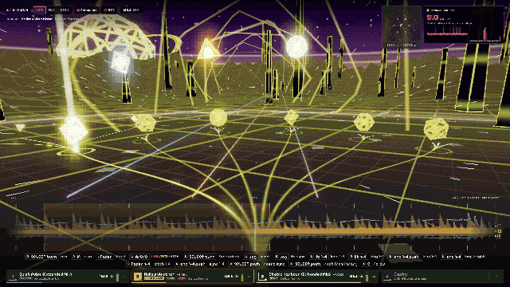

# X1 D. Four

**DJ decks and a music visualizer in one, for the Allen & Heath Xone:4D.** Four decks play straight into the mixer's channels through X1 D. Four's own Rust USB driver at 5 ms latency, and the screen that runs your mix turns your library into a demoscene flight that branches as you play. The visuals are the track browser: you pick the next track by choosing a path, and the world answers the music and the mixer's own controls.

*Unofficial: not affiliated with or endorsed by Allen & Heath.*



*Recorded against the mock server: travel between the monoliths, an aim that sprouts the paths beyond a gate, a load that flies down the branch, and a climax that jumps to Chromozon.*

The Xone:4D's built-in soundcard only has drivers for Windows and macOS. X1 D. Four talks to its Ploytec USB chip directly through Linux usbfs: no kernel module, no ALSA, no PipeWire, no libusb. It renders each deck straight into the USB packets on a real-time thread, and the mixer's own knobs and buttons drive both the decks and the visuals.

## What you get

### Mix

- **4 decks → 4 channels.** Deck *n* plays into USB pair *n*, and each mixer channel set to **SC (USB)** plays its deck. All the mixing (faders, EQ, filters, FX, cueing) stays on the mixer's analog hardware.
- **5 ms output latency.** Each packet carries 80 frames (1.67 ms at 48 kHz), and 3 packets are in flight by default (`--urbs 2` gives 3.3 ms). The driver's output matches the packets of the reverse-engineered kernel driver byte for byte.
- **Decks:** tempo sync to the mixer's global BPM, measured from its MIDI clock over 8 beats (the master deck's tempo when there's no clock; a synced deck ignores its pitch fader). It matches the BPM only: you line up the beats by hand with the right jog, like on turntables, and nothing pulls them back), loops from ½ beat to 32 bars (8 bars by default) that you can move left and right, a jog that jumps through a track and speeds up as you spin, varispeed from the pitch faders, and click-free starts and stops. Every track gets a beat grid when it loads.
- **Volume normalization:** every track is measured when it loads (EBU R128 integrated loudness) and played at −11 LUFS. Loud masters are turned down and quiet ones up, but never so far that the peaks clip (−12…+9 dB). Your trim sits on top.
- **Library:** everything in `~/Music`. Type anywhere to search, then load from the mixer or drag a result onto a deck. Plays MP3, FLAC, WAV, AIFF, AAC/ALAC and Vorbis.
- **The mixer's MIDI controls**: buttons, encoders, faders and jog wheels, mapped in a TOML file that reloads on save, with LED feedback on the lit buttons. The on-screen legend shows what each control does, and `/api/midi/recent` names every control as you touch it.
- **Readout of the mixer's own MIDI clock BPM**, which is the tempo every synced deck plays at.
- **Focus follows you:** loading a deck or starting one focuses it, so the paths grow from the track you just loaded or started.
- **Record the mix:** the REC button (or a mixer button mapped to `mixer.record`) records the mixer's main mix, after your faders, EQ, filters and crossfader, to `~/Music/recordings` as 24-bit 48 kHz WAV. Set channel 4's soundcard input switch 1 to **Mix**: the mixer then sends its main mix to the computer on soundcard input 7/8 (the only input that can carry it). The mix comes before the Mix Master level control, so the master knob doesn't change the recording level. The file stays playable even if the app stops mid-recording, and it shows up in the library when you stop.
- **Live latency scope** in the corner: the output latency now (from the URBs queued at the mixer), the jitter and render time, every USB packet's interval over the last 1.6 s, and how often each interval happens, like a spectrum analyser. A late packet shows in red.

### Visualize

- **A datastream built from your library** (below): tracks similar to what's playing become paths that fork ahead of you, in the band you choose. You fly over a neon grid at the tempo, and the beat, the drops and each deck's level drive the light.
- **Faithful 3-band waveforms** of all four decks on one timeline: kicks stand out as low peaks and breakdowns drop. While you turn the right jog, the strip zooms in to ±1.6 s and the waveform moves with the wheel, so you can line up the beats by eye.
- **Instant:** every mixer move shows in the next frame, and the scene runs at 60 fps on integrated graphics.

## Explore: the Datastream

The main screen is a fast flight over an endless neon grid, in the style of the German demoscene, drawn as pixel art: the world renders on a grid about 360 pixels tall with an 8-level palette and ordered dithering, and all text uses bundled pixel fonts (Pixelify Sans and VT323, SIL Open Font License). It moves with the tempo while you play.
- Every track is analysed in three bands, like the mixer's EQ: **low** (kick, bass, groove), **mid** (harmony, key) and **high** (hats, percussion, air). Each band is a sector with its own neon: Sector Sub (magenta), Sector Chord (acid green), Sector Air (cyan).
- The paths are the tracks whose vibe in the chosen band best matches the focused deck's track, and that would mix with it:
  - **low**: the groove (where the kicks and bass hit in the beat, how the bass pumps, the sub/kick/bass balance) at a compatible tempo;
  - **mid**: the harmony (key compatibility on the Camelot wheel, major vs minor mood, how tonal it is, how fast the chords move);
  - **high**: the percussion (where the hats land relative to the kick, how dense and bright they are).
  
  Each track is described by its body (its louder half: drops and grooves, not the intro, outro or breakdowns), other edits of the same song count as one, and the paths stay put while it plays.
- The trunk you ride splits ahead into one light rail for each similar track. Each rail ends at a spinning wireframe gate.
- Aiming lights a branch: a head of light runs down it, a light column rises from its gate, and the gate sprouts the paths beyond it (that track's own similar tracks). Nothing moves to the front.
- Loading the aimed track flies you down that branch and through its gate in 0.7 s. That gate's paths become the new forks ahead. Diving (M) makes the same flight without a deck, and the picture stays desaturated until a load claims the track.
- The mixer's MIDI drives it as well: every message (buttons, encoders, faders, jogs) launches a glowing data packet from its pod's side, coloured by its deck, the data flow lights the grid and builds the world sooner, and the jogs scratch the grid back and forth with the wheel.
- **Each channel has its own part of the world**, driven by its low, mid and high after your fader and EQ: channel 1 the ground (low raises the land, mid lights the grid, high makes it shimmer), channel 2 the sky (horizon glow, copper bars and aurora, stars), channel 3 the paths (rails, gates, light packets) and channel 4 the motion (speed, field of view, streaks and fringes). Set channels 1-3's soundcard input switches to **Channel** and **Post fader**: their soundcard inputs then carry each channel as you hear it. Channel 4 (whose input carries the mix) is estimated from deck 4 and the mix.
- **Deck guardians:** each deck has its sigil (◆ ▲ ● ■) as a big wireframe solid in its colour across the top of the view. It grows with the deck's low, glows with its mid, spins and sparkles with its high and kicks on the deck's own beat, after the mixer's fader where that's measured, so a deck you fade out shrinks to a speck.
- **Fly between the monoliths:** they crowd up beside your line and leave a narrow lane on it, so you rush between tall slabs; they keep off the paths and gates ahead.
- **Deck meters:** every deck card shows its channel's volume, with a peak hold and the level in dB: bright when it's measured after the mixer's fader, dim when it's what the deck sends.
- The mix volume drives it, at once (the mixer's level reaches the screen 120 times a second as the loudest value since the last frame, with an instant rise and a 50-120 ms fall): with no volume the world goes flat and dark, slows down and nothing bumps (bass, kicks, beats, lasers and copper bars all scale with the mix), it rises and lights up as the mix comes in, burns brighter when it's hot, and a slam from quiet to loud is a climax. It reads the mixer's main mix from soundcard input 7/8 (channel 4's soundcard input switch on Mix), so it follows your faders, EQ, filters and crossfader, not just the decks.
- The bass drives it: a fast bass envelope pumps the grid, the rails and the gates, every kick punches the camera and sends a ring over the grid, and the flight speeds up with the low end.
- **Worlds.** A climax in the mix (a long breakdown where the bass drops away, then the bass slamming back) hyperjumps into a new world: the view stretches, the screen whites out and you land somewhere else (no title card). Five worlds take turns: **Neon Grid**, **Chromozon** (a liquid chrome sea under a striped sunset), **Tunnelwerk** (an Amiga checkerboard tunnel), **Nachtflug** (night flight over wireframe mountains under the aurora) and **Kupferzeit** (copper bars over a checkerboard). Each has its own paths (curves, chrome swoops, angular tracks, a runway of lights, copper steps) and labels, and evolves the longer you stay.
- **Within a world**, a new track sweeps new land in from the horizon, and when the mix moves to another deck, the colours drift to that deck's colour and the textures change.
- The world builds up as you play (progressive generation): after a few minutes of music, wireframe ridges rise beside the paths, then neon monoliths, a hypertunnel of hexagon frames, a planet in orbit and an old-school plasma sky.; heavy bass and taking branches build it sooner.
- Each deck has a copper bar in the sky and a laser that rises from its card. Both bounce on the deck's own beat, so synced decks move together. A ring races over the grid on every beat, and a drop after a breakdown flashes the screen, sends out a shock wave and makes you go faster.
- A chrome sine scroller names where you are. Bloom, chromatic aberration and scanlines finish the frame.
- The path names fade out 3 s after you last aimed and come back as soon as you turn the wheel.
- Every response appears in the next frame; flourishes take at most 300 ms (the flight takes 720 ms, a world jump 1.5 s).
- Analysing a 2,300-track library takes about a minute on a desktop CPU; after that it's instant from a cache.

It's played entirely from the mixer:

| | Left pod | Right pod |
|---|---|---|
| Lit buttons 1–4 | load the aimed track onto deck 1–4 (and fly down its branch) | play/pause deck 1–4 |
| Jog wheel | move through the focused deck: turn slowly for precision, spin to fly (a synced deck moves in whole beats) | shift the focused deck to line up its beats, like a hand on the platter (it keeps the offset) |
| JOG/SELECT | focus deck 1–4 (the paths grow from it); push to start from the search selection | aim between paths; push to jump the focused deck onto the master's beat once |
| Buttons | A low, B mid, C high band; E follow the focused deck on/off | M scout down the aimed path |
| Encoders 1–4 | push = 8-bar loop on deck 1–4; turn = loop length | turn = move the loop (a beat per click, or its own length when shorter); push = loop on/off; shift + push = sync on/off |
| Faders 1–4 | pitch ±8 % | |

The crossfader picks the band: left low, middle mid, right high. It only sends MIDI with **XFADE CURVE** turned fully left.

## Map controls by talking to your agent

Every control on the mixer has a name in [`config/controls.toml`](config/controls.toml) (`left.jog`, `right.lit1`, `left.fader3`…). Mappings are plain TOML:

```toml
[[map]]
control = "right.lit1"
action = "deck.play_pause"
deck = 1
led = "deck.playing"
```

The repo ships a [`CLAUDE.md`](CLAUDE.md), so you can ask an AI coding agent for things like *"make the left jog wheel scroll the library"*. It finds the control, edits the file, and the app picks up the change while it plays.

## Requirements

- Linux (tested on Arch, kernel 7.2) and an **Allen & Heath Xone:4D on audio firmware 1.4.1**.
  - Earlier firmware uses different USB endpoints and isn't supported.
  - A&H's firmware updater runs on Windows; a VM with USB passthrough works.
- Rust 1.85 or newer, and [bun](https://bun.sh) for the UI.

## Quick start

```sh
git clone https://github.com/capatina/x1-d-four && cd x1-d-four
setup/install                              # udev rule: lets your user open the mixer (asks for your password once)
(cd ui && bun install && bun run build)
cargo build --release
target/release/x1-d-four --open             # or open http://127.0.0.1:7878 yourself
```

Set each channel's source switch on the mixer to **SC**. Type to search, or aim a path in the Datastream with the right JOG/SELECT knob, then load it onto a deck with the left lit buttons 1–4; the right lit buttons play/pause decks 1–4. The full layout is in the table above.

Other commands:
- `x1-d-four probe --pair 2`: plays a test tone into USB pair 2.
- `x1-d-four serve --no-device`: runs the UI without hardware.
- `x1-d-four release`: hands the mixer back to the kernel driver after a crash.

### Rings that follow the decks

Rings that light while a deck plays need the mixer's host-driven ring mode, set once on the mixer:
1. Hold the push-knob above the left jog wheel (**JOG/SELECT**) and press the right one. The lit buttons now show the MIDI channel.
2. Press the left JOG/SELECT once.
3. Make sure the 2nd lit button is on (Map 2) and the 3rd is **off**.
4. Press the left JOG/SELECT again to save.

A long press on the left JOG/SELECT toggles the shift layer (**SFT** on the display), and the shift layer has its own mappings.

## With the Ozzy kernel driver

You don't need a kernel driver at all. If you also use [Ozzy](https://github.com/mischa85/Ozzy) (`snd-usb-ozzy`) for desktop audio, X1 D. Four takes the mixer from it on start and gives it back on exit. Use a build with the unbind drain fix from [capatina/Ozzy@ginkomarchy](https://github.com/capatina/Ozzy/commits/ginkomarchy); an older build cuts its stream mid-packet when it lets go, and the 4D then needs a power cycle.

## How it works

```
 Xone:4D ──USB──▶ /dev/bus/usb/BBB/DDD (usbfs: SUBMITURB / REAPURB / CONTROL / CLEAR_HALT)
                    │
          RT thread │ reap any URB:
                    │   EP 0x05 OUT  render 80 frames of 4 decks → 3856-byte packet (+1 MIDI byte) → resubmit
                    │   EP 0x86 IN   the mixer's 8 record channels → meters, recording
                    │   EP 0x83 IN   MIDI from the mixer's controls
                    ▼
     lock-free queues ◀──▶ control side: mappings, library, track decoding, axum HTTP + WebSocket
                                                                     ▲
                                                           browser UI (Svelte)
```

Everything runs on one real-time thread and one file descriptor, with no event loop in between. The protocol details, and the rules that keep the 4D from locking up, are in [`CLAUDE.md`](CLAUDE.md). The browser↔server protocol is in [`docs/protocol.md`](docs/protocol.md).

| Crate / folder | What |
|---|---|
| `crates/ploytec` | the driver: usbfs ioctls, bring-up, packet codec, MIDI |
| `crates/engine` | decks, track decoding (symphonia + rubato), the real-time renderer |
| `crates/app` | the `x1-d-four` binary: server, library, control catalog, mappings |
| `ui/` | Svelte 5 + Vite, embedded in the binary |

## Credits

- **[Ozzy](https://github.com/mischa85/Ozzy)** by Marcel Bierling reverse-engineered the Ploytec protocol; the codec and bring-up sequence are ported from it.
- The control catalog follows Allen & Heath's Xone:4D user guide (AP7265 issue 3).

Not affiliated with or endorsed by Allen & Heath. "Xone" is their trademark. Use at your own risk: a misbehaving USB stream can lock up the mixer's audio until you power-cycle it.

## License

[MIT](LICENSE)
