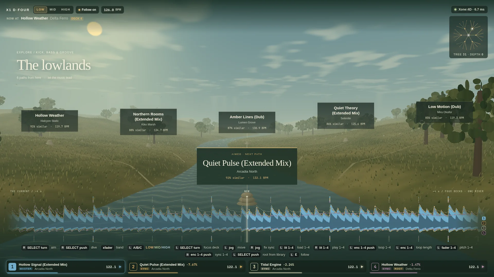

# X1 D. Four

**Bare-metal decks for the Allen & Heath Xone:4D.** A userspace USB driver written in Rust, plus a browser UI: four decks playing into the mixer's four channels at 5 ms latency. No kernel module, no ALSA, no PipeWire, no libusb.

*Unofficial: not affiliated with or endorsed by Allen & Heath.*



The Xone:4D's built-in soundcard only has drivers for Windows and macOS. X1 D. Four talks to its Ploytec USB chip directly through Linux usbfs. It renders each deck straight into the USB packets on a real-time thread, and the mixer's own knobs and buttons drive the decks.

## What you get

- **4 decks → 4 channels.** Deck *n* plays into USB pair *n*, and each mixer channel set to **SC (USB)** plays its deck. All the mixing (faders, EQ, filters, FX, cueing) stays on the mixer's analog hardware.
- **5 ms output latency.** Each packet carries 80 frames (1.67 ms at 48 kHz), and 3 packets are in flight by default (`--urbs 2` gives 3.3 ms). The driver's output matches the packets of the reverse-engineered kernel driver byte for byte.
- **Decks:** play/pause, CDJ-style cue, click-to-seek waveforms, nudge, varispeed, and click-free starts and stops.
- **Library:** everything in `~/Music`, with search. Plays MP3, FLAC, WAV, AIFF, AAC/ALAC and Vorbis.
- **The mixer's MIDI controls**: buttons, encoders, faders and jog wheels, mapped in a TOML file that reloads on save, with LED feedback on the lit buttons. The UI's live MIDI monitor names every control as you touch it.
- **Readout of the mixer's own MIDI clock BPM.**

## Explore: a living river valley

The main screen is a living river valley through your music.
- Every track is analysed in three bands, like the mixer's EQ: **low** (kick, bass, groove), **mid** (harmony, key) and **high** (hats, percussion, air).
- Branching paths show the tracks most similar to what's playing, in the band you choose. As the track moves into a breakdown or a drop, the neighbours shift.
- Aim at a path, dive into the next grove, and keep going. Music drives the wind; grass grows, wildlife arrives, and daylight shifts over the mix. Four deck waveforms become the river's foreground contours, with aligned beat grids and visible loops.
- Analysing a 2,300-track library takes about a minute on a desktop CPU; after that it's instant from a cache.

It's played entirely from the mixer:

| | Left pod | Right pod |
|---|---|---|
| Lit buttons 1–4 | load the aimed track onto deck 1–4 | play/pause deck 1–4 |
| Jog wheel | move through the focused deck: turn slowly for precision, spin to fly (a synced deck moves in whole beats) | shift the focused deck to fix its sync (it keeps the offset) |
| JOG/SELECT | focus deck 1–4 (the valley grows from it); push to start from the search selection | aim between paths; push to reset the focused deck's sync |
| Buttons | A low, B mid, C high band; E follow the focused deck on/off | M dive into the aimed path |
| Encoders 1–4 | push = 8-bar loop on deck 1–4; turn = loop length | skip ±2 s; push = sync |
| Faders 1–4 | pitch ±8 % | |

The crossfader picks the band: left low, middle mid, right high. It only sends MIDI with **XFADE CURVE** turned fully left.

## Map controls by talking to your agent

Every control on the mixer has a name in [`config/controls.toml`](config/controls.toml) (`left.jog`, `right.lit1`, `left.fader3`…). Mappings are plain TOML:

```toml
[[map]]
control = "right.lit1"
action = "deck.play_pause"
deck = 1
led = "deck.playing"
```

The repo ships a [`CLAUDE.md`](CLAUDE.md), so you can ask an AI coding agent for things like *"make the left jog wheel scroll the library"*. It finds the control, edits the file, and the app picks up the change while it plays.

## Requirements

- Linux (tested on Arch, kernel 7.2) and an **Allen & Heath Xone:4D on audio firmware 1.4.1**.
  - Earlier firmware uses different USB endpoints and isn't supported.
  - A&H's firmware updater runs on Windows; a VM with USB passthrough works.
- Rust 1.85 or newer, and [bun](https://bun.sh) for the UI.

## Quick start

```sh
git clone https://github.com/capatina/x1-d-four && cd x1-d-four
setup/install                              # udev rule: lets your user open the mixer (asks for your password once)
(cd ui && bun install && bun run build)
cargo build --release
target/release/x1-d-four --open             # or open http://127.0.0.1:7878 yourself
```

Set each channel's source switch on the mixer to **SC**. Load tracks from the library with the 1–4 buttons, or from the mixer. The default mapping is:
- the left jog wheel browses the library;
- the left lit buttons load decks 1–4;
- the right lit buttons play/pause decks 1–4.

Other commands:
- `x1-d-four probe --pair 2`: plays a test tone into USB pair 2.
- `x1-d-four serve --no-device`: runs the UI without hardware.
- `x1-d-four release`: hands the mixer back to the kernel driver after a crash.

### Rings that follow the decks

Rings that light while a deck plays need the mixer's host-driven ring mode, set once on the mixer:
1. Hold the push-knob above the left jog wheel (**JOG/SELECT**) and press the right one. The lit buttons now show the MIDI channel.
2. Press the left JOG/SELECT once.
3. Make sure the 2nd lit button is on (Map 2) and the 3rd is **off**.
4. Press the left JOG/SELECT again to save.

A long press on the left JOG/SELECT toggles the shift layer (**SFT** on the display), and the shift layer has its own mappings.

## With the Ozzy kernel driver

You don't need a kernel driver at all. If you also use [Ozzy](https://github.com/mischa85/Ozzy) (`snd-usb-ozzy`) for desktop audio, X1 D. Four takes the mixer from it on start and gives it back on exit. Use a build with the unbind drain fix from [capatina/Ozzy@ginkomarchy](https://github.com/capatina/Ozzy/commits/ginkomarchy); an older build cuts its stream mid-packet when it lets go, and the 4D then needs a power cycle.

## How it works

```
 Xone:4D ──USB──▶ /dev/bus/usb/BBB/DDD (usbfs: SUBMITURB / REAPURB / CONTROL / CLEAR_HALT)
                    │
          RT thread │ reap any URB:
                    │   EP 0x05 OUT  render 80 frames of 4 decks → 3856-byte packet (+1 MIDI byte) → resubmit
                    │   EP 0x86 IN   recycle (8 record channels)
                    │   EP 0x83 IN   MIDI from the mixer's controls
                    ▼
     lock-free queues ◀──▶ control side: mappings, library, track decoding, axum HTTP + WebSocket
                                                                     ▲
                                                           browser UI (Svelte)
```

Everything runs on one real-time thread and one file descriptor, with no event loop in between. The protocol details, and the rules that keep the 4D from locking up, are in [`CLAUDE.md`](CLAUDE.md). The browser↔server protocol is in [`docs/protocol.md`](docs/protocol.md).

| Crate / folder | What |
|---|---|
| `crates/ploytec` | the driver: usbfs ioctls, bring-up, packet codec, MIDI |
| `crates/engine` | decks, track decoding (symphonia + rubato), the real-time renderer |
| `crates/app` | the `x1-d-four` binary: server, library, control catalog, mappings |
| `ui/` | Svelte 5 + Vite, embedded in the binary |

## Credits

- **[Ozzy](https://github.com/mischa85/Ozzy)** by Marcel Bierling reverse-engineered the Ploytec protocol; the codec and bring-up sequence are ported from it.
- The control catalog follows Allen & Heath's Xone:4D user guide (AP7265 issue 3).

Not affiliated with or endorsed by Allen & Heath. "Xone" is their trademark. Use at your own risk: a misbehaving USB stream can lock up the mixer's audio until you power-cycle it.

## License

[MIT](LICENSE)
