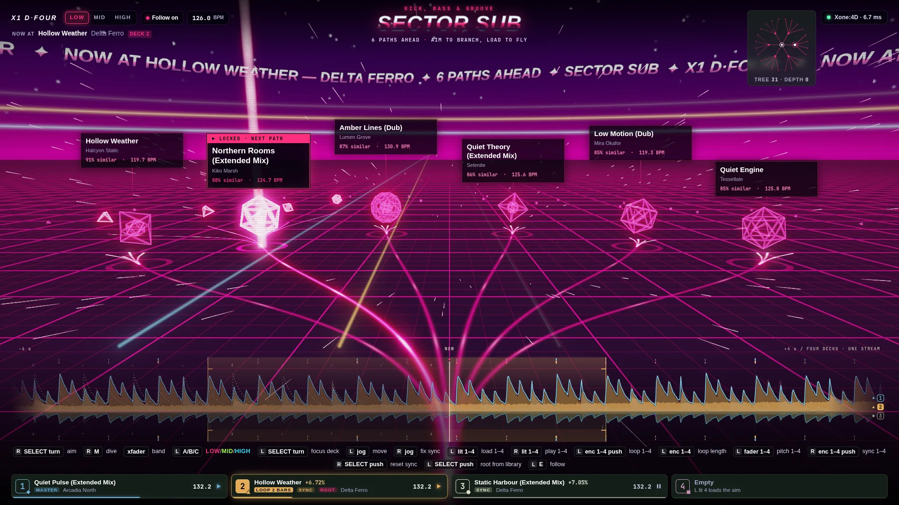

# Explore: the Datastream

Explore is a fast flight over an endless neon grid, in the style of the German
demoscene: black, crisp neon lines, wireframe solids, copper bars, a chrome
sine scroller, bloom and hard flashes on the beat. The visuals are the track
browser: the paths ahead are the tracks most similar to where you are.

## What each element means

| On screen | Means | Driven by |
|---|---|---|
| The trunk under the camera, splitting ahead | where you stand (`current`); the paths match the focused deck's whole track and don't change while it plays | `explore.current` |
| A light rail from the split to a spinning wireframe gate | a candidate track; the gate's size and brightness show its similarity | `explore.nodes` (children) |
| A lit rail, a head of light running down it, a light column over its gate | the aimed track | `explore.aim` |
| Small rails and gates sprouting from the aimed gate | the aimed track's own similar tracks (grandchildren) | `explore.nodes` |
| Flying down the branch and through its gate | loading the aimed track (a **commit**) | `reason: "commit"` |
| The same flight, then a desaturated picture with grain | a **scout** (button M); it clears when a load claims the track | `reason: "dive"` |
| Flying back down the trunk | going back up the path | `reason: "back"` |
| A tear across the frame | a new root, band or re-shuffle (a **cut**) | other reasons |
| The grid's colour: magenta, acid green or cyan | the low, mid or high band (Sector Sub, Chord, Air) | `explore.band` |
| A copper bar in the sky and a laser rising from the deck's card | decks 1–4, by level; they bounce on the deck's own beat, so synced decks move together | `state.decks`, `viz.decks` |
| A ring racing out over the grid | each beat of the master deck | the master's grid |
| A white flash, a shock wave and a surge of speed | a drop after a breakdown (low band under 0.25 for 8 s, then above 0.6) | smoothed `viz.bands` |
| The scroller | where you are, how many paths lie ahead, the sector | `explore`, the library |

## Bass and motion

- **Bass.** The low band goes through a fast envelope (12 ms attack, 160 ms
  release) that is levelled against its own recent peak, so quiet and loud
  tracks both move the world. The grid, the rails, the gates, the horizon, the
  streaks and the bloom pump with it, and the flight goes up to 45 % faster.
- **Kicks.** A sharp rise of the bass above its slow average is a kick: the
  camera punches down and rolls, the field of view kicks, a ring races out over
  the grid, the rails and the tunnel flash, and the frame fringes.
- **Drift.** The camera always sways, bobs and rolls a little, more with energy.

## Worlds

A climax jumps to the next world. The watch runs on the raw bass envelope
against its usual level (a 20 s average of the non-breakdown bass): under 40 %
for at least 6 s is a breakdown; the bass back over 85 % within 2.5 s of it is
the climax. Jumps are at least 30 s apart. The jump takes 1.5 s: the field of
view stretches by up to 50°, the speed goes ×8 and the fringes wide, and the
world swaps under a white-out at 43 %.

| World | Land and sky | Paths | Labels |
|---|---|---|---|
| 1 Neon Grid | the neon grid; diagonal traces and a laser sweep join as it evolves | light rails, curves | black glass |
| 2 Chromozon | a chrome sea reflecting a sunset; a striped sun that grows | chrome ribbons, wide swoops | chrome pills |
| 3 Tunnelwerk | an Amiga checkerboard tunnel; it twists and splits as it evolves | checkered blocks, one hard turn | black and white blocks |
| 4 Nachtflug | wireframe mountains in deep blue; aurora curtains, a sky of stars | a runway of chasing lights, weaving | HUD brackets |
| 5 Kupferzeit | a checkerboard floor; rainbow copper bars fill the sky, more as it evolves | rainbow copper bars, stepped | copper-bar headers |

Each world tints the band's colour toward its own, sets its scanlines and
bloom, shows the generations that suit it, and evolves over 4 minutes of music
(`uEvo`). The flight follows the world's path shapes.

**Within a world:** a new track (a new root, or a branch taken) reseeds the
land: terrain, monoliths and floor pattern take a new seed beyond a bright front
that sweeps from the horizon to the camera in 2.5 s. When another deck stays
1.3× louder than the loudest for 1.5 s, the colours crossfade toward its deck
colour (1.2 s) and the textures switch to its variant (grid cell and angle,
wave frequency, tunnel checks or stripes, checker size) under a short tear.

**Labels** fade out 3 s after the aim last moved and fade back in when it moves
or a new fan appears.

QA: `__datastream.climax()`, `world(n)`, `evolve(e)`, `reseed()`.

## MIDI data flow

Every MIDI message from the mixer (`midi` messages; LED echoes and releases are
ignored) launches a data packet: a glowing point with a trail that leaves from
its pod's side of the screen (left pod left, right pod right), coloured by its
deck (lit buttons, encoders, faders), and arcs away over the grid, higher for a
bigger value. The data flow lifts the grid and the streaks, and each message
counts as a second of music toward the next generation (at most one every
150 ms). A jog's turn scratches the grid with the wheel: the right jog 0.6 units
per tick, the left 2.2.

## Progressive generation

The world builds up as the music plays. Each layer builds over 5 s once enough
(weighted) music has played: time counts faster with heavy bass, each branch
you take counts as 20 s, and the MIDI data flow adds to it.

| Generation | After | What builds |
|---|---|---|
| 1 Ridges | 0.4 min | wireframe mountains beside and beyond the paths; their height breathes with the bass and the spectrum |
| 2 Monoliths | 1.5 min | black slabs with neon edges and climbing scan bands, placed on the grid by hash, never on the paths |
| 3 Hypertunnel | 3 min | hexagon frames you fly through, flashing on kicks |
| 4 Orbit | 5 min | a giant wireframe planet with a ring, rising behind the ridges |
| 5 Plasma | 8 min | an old-school plasma rolling in the sky |

Each new generation gets a title card. `__datastream.setGen(n)` and `kick()`
force them for QA.

## Travel

The world is built in the frame of the current fan, with the camera resting at
its origin looking down −z.

- **Speed.** Travel is clocked to tempo, never to deck position: beats per
  second × (14 + 16 × smoothed energy) units per beat, ×2.5 just after a drop.
  At 126 BPM that is 30–60 units a second. The grid streams under the camera,
  speed streaks lengthen with speed, and light packets race down the rails a
  little faster than you travel.
- **Stopping.** When nothing plays, the speed halves at once and then drifts to
  a stop; the colours dim and the packets slow.
- **The flight.** On a commit or scout, the new fan is built at once in a frame
  that stands on the taken gate and faces along the branch. The camera flies
  down the trunk and the branch (720 ms, ease in and out), dips through the
  gate, and settles onto the new fan's line of sight. The old fan fades behind
  it. On arrival the world is rebased so that the new fan's frame is the world
  again; the grid's rotation and offset absorb the move, so the grid never
  jumps. A message during a flight lands it at once first.

## Instant, then flourish

State changes in the message frame, and flourish decays from it.

- Label text, `data-kind`, the lit rail and the gate are written before the
  next animation frame. Keys, the wheel and clicks aim in the same event, and
  the server's echo reconciles.
- Aiming: the branch is lit at frame 0, a head of light runs down it in
  160 ms, and the gate's own paths sprout over 220 ms after 60 ms. The
  previous aim decays in 140 ms and its paths shrink back to stubs.
- Band colours settle in 180 ms. A cut tears the frame for 220 ms.
- Label positions are projected only on layout or resize, from the resting
  camera, so they never move during travel.

## Rendering

One forward pass into a 4× MSAA half-float target: the sky (a sphere that
follows the camera), the floor (a plane that follows the camera, with the grid
computed in the shader), the two fans (rails as flat strips with a slot
attribute, gates as barycentric wireframes) and the streaks. Then a bright
pass at ¼ resolution, two blur passes at ¼ and two at ⅛, and the composite:
bloom, deck lasers, chromatic aberration, mist, flashes, ACES tone mapping,
scanlines and a vignette. The frame loop allocates nothing.

With `prefers-reduced-motion`, there is no travel, flight, flash, tear or
aberration; changes are instant.

## QA

With `?qa`, `window.__datastream` freezes and steps the clock (CSS animations
with it), records message-to-frame timings, reads GPU timer queries and can
force a drop. `?stats` shows fps, draw calls, frame times, course and speed.
